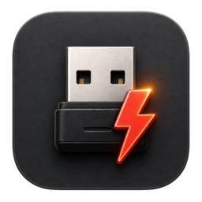

<p align="center">
  
</p>

<h1 align="center">BoltUpdateTool</h1>

<p align="center">
  <strong>Deutsch</strong> · <a href="README.md">English</a>
</p>

<p align="center">
  An unofficial macOS and Windows firmware updater for the Logitech Bolt USB receiver.<br>
  Entstanden, weil ein Bolt-Empfänger mit älterer Firmware an der PS5 nicht funktionierte.
</p>

> [!WARNING]
> Dieses Projekt ist experimentell und nicht von Logitech entwickelt, geprüft oder unterstützt.
> Ein unterbrochener oder ungeeigneter Firmware-Flash kann den Empfänger unbrauchbar machen.
> Verwende das Tool auf eigene Verantwortung und nach Möglichkeit zunächst mit einem
> entbehrlichen Testempfänger.

## Überblick

BoltUpdateTool bietet native Apps für macOS (SwiftUI) und Windows (WPF/.NET). Es erkennt einen
Logitech-Bolt-Empfänger, liest dessen Firmwareinformationen über HID++ aus und überträgt ein vom
Nutzer ausgewähltes, signiertes Firmwarepaket. Die Firmware selbst ist **nicht** Bestandteil
dieses Repositorys und wird von den Apps auch nicht aus dem Internet geladen.

Die App unterstützt den vollständigen Aktualisierungsablauf:

1. Bolt-Empfänger im normalen Betriebsmodus erkennen
2. installierte Firmwarekomponenten auslesen
3. zwei ausgewählte DFU-Dateien validieren
4. den Empfänger in den Bootloader versetzen
5. Applikations- und Funk-Firmware übertragen
6. den Empfänger neu starten und die installierte Version prüfen

Der Fortschrittsbalken bleibt während des Flashens sichtbar. Wenn der automatische Wechsel in
den Bootloader nicht sofort erkannt wird, führt die App verständlich durch das Abziehen und
erneute Einstecken des Empfängers.

## PlayStation 5 (PS5) Kompatibilität

Ich habe dieses Tool gebaut, weil mein Logitech-Bolt-Empfänger mit seiner älteren Firmware an
der PS5 nicht funktionierte. Nach dem Update auf die Applikationsfirmware `MPR05.03_B0020` und
die Funkfirmware `00.00_B013E` funktionierte er bei mir.

Wenn dein Logitech-Bolt-Empfänger an der PlayStation 5 nicht funktioniert, kann ein
Firmwareupdate helfen. Die Firmware ist nicht enthalten und die Kompatibilität kann je nach
Gerät abweichen. Das Projekt ist inoffiziell und steht nicht mit Logitech oder Sony in
Verbindung.

## Projektstatus

- Hardware-getestet mit Logitech Bolt USB Receiver
- Native Apps für macOS und Windows
- Lokale Verarbeitung ohne Telemetrie oder Netzwerkzugriff
- Firmware muss manuell ausgewählt werden
- Kein absichtlicher Downgrade-Modus
- Windows-Versionen für ARM64 und 32-Bit-x86 verfügbar; natives x64 ist noch nicht veröffentlicht

Obwohl der praktische Updateablauf getestet wurde, sollte die App weiterhin als experimentell
betrachtet werden. Unterschiedliche Hardware- oder Firmware-Revisionen können sich anders
verhalten.

## Unterstützte Hardware

| Zustand | USB Vendor ID | USB Product ID | Protokoll |
|---|---:|---:|---|
| Normalbetrieb | `046D` | `C548` | HID++ 1.0 |
| Bootloader | `046D` | `AB07` | HID++ 2.0 |

Im Normalbetrieb wird die Logitech-spezifische HID-Schnittstelle mit Usage Page `FF00` und
Usage `0001` verwendet. Die übrigen HID-Schnittstellen des Empfängers gehören unter anderem zu
Tastatur-, Maus- und Consumer-Control-Funktionen und sind für das Update nicht geeignet.

Andere Logitech-Empfänger, Unifying-Empfänger und beliebige Geräte mit abweichenden IDs werden
nicht unterstützt.

## Voraussetzungen

Zum Ausführen:

- macOS 26.0 oder neuer oder eine kompatible Windows-10/11-Installation
- Logitech Bolt USB Receiver
- zwei zueinander passende, signierte Bolt-DFU-Dateien
- eine stabile, direkte USB-Verbindung

Zum Bauen:

- Xcode 26 oder neuer
- Swift 5 Language Mode
- ein für macOS konfiguriertes Apple-Developer-Team, falls die App signiert oder notarisiert
  verteilt werden soll
- .NET 10 SDK unter Windows für die WPF-App

Das derzeitige Deployment Target der macOS-App ist macOS 26.0. Windows-Downloads sind für ARM64
und 32-Bit-x86 verfügbar. Beide benötigen die zur Architektur passende .NET 10 Desktop Runtime.

## Downloads

| Plattform | Download | Hinweise |
|---|---|---|
| macOS | [BoltUpdateTool 1.0.0](https://github.com/FelixStopa/BoltUpdateTool/releases/tag/v1.0.0) | Universal, Developer-ID-signiert und notarisiert |
| Windows ARM64 | [ZIP herunterladen](https://github.com/FelixStopa/BoltUpdateTool/releases/download/windows-v1.0.0/BoltUpdateTool-1.0.0-Windows-arm64.zip) | Benötigt .NET 10 Desktop Runtime ARM64; nicht signiert |
| Windows x86 (32 Bit) | [ZIP herunterladen](https://github.com/FelixStopa/BoltUpdateTool/releases/download/windows-v1.0.0/BoltUpdateTool-1.0.0-Windows-x86.zip) | Benötigt .NET 10 Desktop Runtime x86; nicht signiert |

Die Windows-Apps sind noch nicht mit Authenticode signiert. Windows SmartScreen kann deshalb
eine Warnung anzeigen. Prüfe vor dem Start die beim jeweiligen Download veröffentlichte
SHA-256-Prüfsumme. Die x86-Version ist eine 32-Bit-App und läuft auch auf kompatiblen
x64-Windows-Installationen; ein nativer x64-Build ist noch nicht veröffentlicht.

## Firmware auswählen

BoltUpdateTool erwartet **zwei entpackte `.dfu`-Dateien**, die gemeinsam in der Dateiauswahl
markiert werden:

- die Applikations-Firmware des Empfängers
- die zugehörige Funk-/Sekundär-Firmware

Eine ZIP-Datei kann nicht direkt ausgewählt werden. Entpacke das rechtmäßig bezogene
Firmwarepaket vorher und wähle anschließend beide DFU-Dateien gleichzeitig aus.

### Externer Firmware-Download

Ein Firmwarepaket, das mit diesem Tool verwendet wurde, ist bei diesem externen Filehoster
verfügbar:

**[Firmware bei GoFile herunterladen](https://gofile.io/d/oJAxyJ)**

Die Dateien werden von einem externen Filehoster bereitgestellt. Ich bin weder Eigentümer noch
Anbieter dieser Dateien, habe keine Kontrolle über deren Inhalt und stehe weder mit dem
Filehoster noch mit Logitech oder Sony in Verbindung. Der Link wird lediglich als Hinweis
bereitgestellt, ohne Garantie für Verfügbarkeit, Echtheit, Sicherheit oder Kompatibilität.
Alle Rechte an der Firmware verbleiben bei den jeweiligen Rechteinhabern. Stelle vor dem
Herunterladen oder Verwenden sicher, dass du alle anwendbaren Lizenzen und Bedingungen
einhältst.

Die App prüft unter anderem:

- Dateiendung und plausible Dateigröße
- erwartete Bolt-DFU-Kennung
- unterschiedliche und zueinander passende Firmware-Entitäten
- Applikations- und Funkkomponente als vollständiges Paar

Diese Prüfungen reduzieren versehentliche Falschauswahlen, können aber nicht garantieren, dass
ein Paket zu jeder Hardware-Revision passt. Verwende ausschließlich signierte Firmware aus
einer Quelle, zu deren Nutzung du berechtigt bist.

## Verwendung

1. Schließe Anwendungen, die auf den Empfänger zugreifen können, beispielsweise Logi Options+.
2. Verbinde den Bolt-Empfänger möglichst direkt mit dem Computer.
3. Starte BoltUpdateTool.
4. Prüfe die angezeigten Firmwareinformationen.
5. Klicke bei den Firmwaredateien auf **Change files**.
6. Wähle beide zusammengehörigen `.dfu`-Dateien gleichzeitig aus.
7. Prüfe die erkannten Versionsnummern.
8. Starte das Update mit **Update receiver**.
9. Ziehe den Empfänger nur dann ab und stecke ihn wieder ein, wenn die App ausdrücklich dazu
   auffordert.
10. Warte auf die erfolgreiche Abschlussprüfung.

Während Firmwaredaten geschrieben werden, darf die USB-Verbindung nicht getrennt und der
Computer nicht ausgeschaltet werden.

## Technischer Ablauf

Im Normalbetrieb kommuniziert die App über HID++ 1.0 mit dem Empfänger. Über das Register `F5`
wird der signierte DFU-Modus vorbereitet. Danach meldet sich das Gerät mit der Bootloader-PID
`AB07` neu an.

Im Bootloader verwendet BoltUpdateTool HID++ 2.0 und die DFU-Funktion `0x00D0`. Die Images
werden paketweise übertragen, bestätigt und anschließend aktiviert. Danach wartet die App
erneut auf die Runtime-PID `C548` und liest die Firmwareinformationen zur Kontrolle aus.

```text
C548 Runtime
    │  HID++ 1.0 / DFU vorbereiten
    ▼
AB07 Bootloader
    │  HID++ 2.0 / Firmware übertragen
    ▼
C548 Runtime
       Versionen erneut auslesen
```

## Fehlerbehebung

### Der Empfänger wird nicht gefunden

- Bolt-Empfänger abziehen und erneut verbinden
- einen direkten USB-Port statt eines instabilen Hubs verwenden
- Logi Options+, Logitech Firmware Update Tool und ähnliche Programme vollständig beenden
- mit **Refresh info** erneut suchen
- prüfen, ob tatsächlich ein Bolt-Empfänger mit PID `C548` angeschlossen ist

### Die App wartet auf den Bootloader

Der Empfänger kann während des DFU-Befehls kurz vollständig aus der Geräteliste verschwinden.
Folge der Anzeige in der App. Falls erforderlich, ziehe den Empfänger einmal ab und stecke ihn
wieder ein. Die App wartet anschließend auf die Bootloader-PID `AB07`.

### `IOHIDDeviceSetReport` schlägt fehl

Häufige Ursachen sind eine von einem anderen Programm belegte HID-Schnittstelle, ein
ungeeigneter USB-Hub oder ein Gerätewechsel genau während des Befehls. Beende andere
Logitech-Programme, verbinde den Empfänger direkt und versuche es erneut.

Ein solcher Fehler bedeutet nicht automatisch, dass bereits dieselbe Firmware installiert ist.
Bei gleicher Version sollte die App den Nutzer darauf hinweisen, anstatt den Fehler als
Versionsvergleich zu interpretieren.

### `DFU packet 0 failed: unhandled status 0x27 (0xa7)`

Der Bootloader hat das Image bereits beim ersten Datenpaket zurückgewiesen. Das tritt
beispielsweise bei einem nicht passenden, beschädigten oder nicht erlaubten Paket auf. Auch
Downgrades können vom signierten Bootloader abgelehnt werden. Wiederholtes Flashen desselben
Pakets umgeht diese Prüfung nicht.

### Die Dateiauswahl wird abgelehnt

Wähle genau zwei entpackte `.dfu`-Dateien desselben Firmwarepakets gleichzeitig aus. Eine
einzelne Datei, zwei Applikationsdateien oder zwei Sekundärdateien bilden kein gültiges Paket.

## Aus dem Quellcode bauen

### macOS

Repository klonen und das Projekt öffnen:

```bash
git clone https://github.com/FelixStopa/BoltUpdateTool.git
cd BoltUpdateTool
open BoltUpdateTool.xcodeproj
```

Wähle in Xcode das Scheme **BoltUpdateTool** und starte die App mit **Run**. Für eine lokale
Entwicklungsfassung kann in den Signing-Einstellungen das eigene Development Team gewählt
werden.

Alternativ lässt sich ein nicht signierter Test-Build über die Kommandozeile erstellen:

```bash
xcodebuild \
  -project BoltUpdateTool.xcodeproj \
  -scheme BoltUpdateTool \
  -configuration Debug \
  -destination 'platform=macOS' \
  CODE_SIGNING_ALLOWED=NO \
  build
```

### Windows

Auf einem Windows-System mit installiertem .NET 10 SDK:

```powershell
cd BoltUpdateToolWin
dotnet restore BoltUpdateTool.Windows.sln
dotnet build BoltUpdateTool.Windows.sln --configuration Release
```

Weitere Angaben zu Architektur, Veröffentlichung und Runtime stehen in
[BoltUpdateToolWin/README.md](BoltUpdateToolWin/README.md).

## Tests

Die macOS-Unit-Tests prüfen insbesondere die Auswahl und Zuordnung der beiden Firmwaredateien:

```bash
xcodebuild \
  -project BoltUpdateTool.xcodeproj \
  -scheme BoltUpdateTool \
  -destination 'platform=macOS' \
  CODE_SIGNING_ALLOWED=NO \
  -only-testing:BoltUpdateToolTests \
  test
```

Die Windows-Protokoll- und HID-Tests werden unter Windows so gestartet:

```powershell
dotnet run --project BoltUpdateToolWin/tests/Bolt.Protocol.Tests
```

Ein Unit-Test ersetzt keinen Hardwaretest. Änderungen an HID++, DFU-Paketierung,
Zeitüberschreitungen oder Geräteübergängen sollten immer zusätzlich mit einem Testempfänger
geprüft werden.

## Projektstruktur

```text
BoltUpdateTool/
├── BoltUpdateTool/                 SwiftUI-App und Zustandsmodell
│   ├── HIDPP/                      HID++, Geräteerkennung und DFU
│   └── Assets.xcassets/            App-Icon und Farben
├── BoltUpdateToolTests/            Unit-Tests
├── BoltUpdateToolUITests/          UI-Test-Target
├── BoltUpdateTool.xcodeproj/       Xcode-Projekt
└── BoltUpdateToolWin/              Windows-WPF/.NET-Projekt und Tests
```

Wichtige Komponenten:

- `HIDDeviceManager`: erkennt Runtime- und Bootloader-Schnittstellen
- `Hidpp10Session`: Kommunikation und Firmwareinformationen im Normalbetrieb
- `Hidpp20Session`: Feature-Erkennung im Bootloader
- `DfuFlasher`: paketweise Übertragung und Statusauswertung
- `FirmwarePackage`: sichere Auswahl und Validierung der beiden DFU-Dateien
- `UpdaterViewModel`: koordiniert Erkennung, Updateablauf, Fortschritt und Fehlermeldungen

## Datenschutz

BoltUpdateTool:

- sendet keine Telemetrie
- enthält keine Benutzerkonten
- lädt keine Firmware herunter
- überträgt keine Geräteinformationen ins Internet

Die Kommunikation findet lokal zwischen der App und dem USB-Empfänger statt. Links in der
Oberfläche werden nur geöffnet, wenn der Nutzer darauf klickt.

## Beiträge

Fehlerberichte und nachvollziehbare Verbesserungen sind willkommen. Bitte gib bei einem
Hardwareproblem mindestens folgende Informationen an:

- Betriebssystemversion und Prozessorarchitektur
- Runtime- oder Bootloader-PID
- angezeigte Firmwareversionen
- vollständige Fehlermeldung ohne private Daten
- ob ein Hub oder Adapter verwendet wurde

Veröffentliche keine proprietären Firmwaredateien oder Bestandteile offizieller
Logitech-Anwendungen in Issues, Pull Requests oder Forks dieses Repositorys.

## Rechtliche Hinweise

Logitech, Logi, Bolt und die zugehörigen Marken sind Eigentum ihrer jeweiligen Rechteinhaber.
Dieses Projekt steht in keiner Verbindung zu Logitech und wird von Logitech weder unterstützt
noch empfohlen.

PlayStation und PS5 sind Marken von Sony Interactive Entertainment Inc. Dieses Projekt steht
in keiner Verbindung zu Sony Interactive Entertainment und wird von Sony weder unterstützt
noch empfohlen.

Das Repository enthält keine Logitech-Firmware und keine offiziellen Logitech-Anwendungen.
Protokollverhalten und Konstanten wurden anhand öffentlich verfügbarer Implementierungen und
durch Geräteanalyse nachvollzogen. Weitere Angaben befinden sich in
[THIRD_PARTY_NOTICES.md](THIRD_PARTY_NOTICES.md).

## Lizenz

BoltUpdateTool steht unter der
[PolyForm Noncommercial License 1.0.0](LICENSE.md). Die Software darf für erlaubte
nichtkommerzielle Zwecke verwendet, verändert und weitergegeben werden. Der Verkauf oder eine
andere kommerzielle Nutzung ist ohne eine gesonderte Erlaubnis des Rechteinhabers nicht
gestattet.

Dies ist eine Source-Available-Lizenz und keine von der OSI anerkannte Open-Source-Lizenz.
Materialien Dritter unterliegen weiterhin ihren jeweiligen Lizenzen, wie in
[THIRD_PARTY_NOTICES.md](THIRD_PARTY_NOTICES.md) beschrieben.

## Kontakt

Projekt und technische Hinweise: [felix.stopa.net](https://felix.stopa.net)
